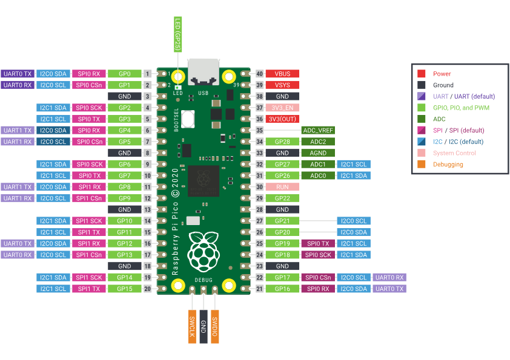

# instructions 
This repo contains all the instructions, for setting up and running an example on the raspberry pi pico. 
> the raspberry pi C sdk mentions that using the kit on a UNIX system is much easier than on Windows. 

## Introduction 
Raspberry Pi Pico is a low-cost, high-performance microcontroller board with flexible digital interfaces. Key features include:
- RP2040 microcontroller chip designed by Raspberry Pi in the United Kingdom
- Dual-core Arm Cortex M0+ processor, flexible clock running up to 133 MHz
- 264kB of SRAM, and 2MB of on-board flash memory
- USB 1.1 with device and host support
- Low-power sleep and dormant modes
- Drag-and-drop programming using mass storage over USB
- 26 × multi-function GPIO pins
- 2 × SPI, 2 × I2C, 2 × UART, 3 × 12-bit ADC, 16 × controllable PWM channels
- Accurate clock and timer on-chip
- Temperature sensor
- Accelerated floating-point libraries on-chip
- 8 × Programmable I/O (PIO) state machines for custom peripheral support

## Pinout and design files

For reference use [this pdf](./Pico-R3-A4-Pinout.pdf)

## contributing 
To contribute to this repo:
1. create a branch from develop outlining the feature you are working on with the following format(with exceptions of documentation, main, develop). 
> f/ultrasonic-ranger 
> f/infrared-circuit
and so on. The f prefix means this is a feature you are implementing. 

2. When you have completed work on your branch. 
3. push your changes to your local feature branch.
4. submit a pull request to develop. 
**Never create a PR to `main` directly. Even the branch protection rules wont let you, just dont.**

PR's that are being merged to main must have been reviewed by at least one person and must always come from `develop` branch. For more understanding about this contribution workflow you may refer to [this article](https://www.atlassian.com/git/tutorials/comparing-workflows/gitflow-workflow). The main reason we are implementing these strict workflows is so that the `main` branch can never have breaking changes or it should always have the latest working version of the firmware.

## Setup 
Follow the instructions on the book getting started with the RP2040 to complete the setup regardless of your OS. Although it is recommended to do development on Linux ultimately, you have sovereign choice.  